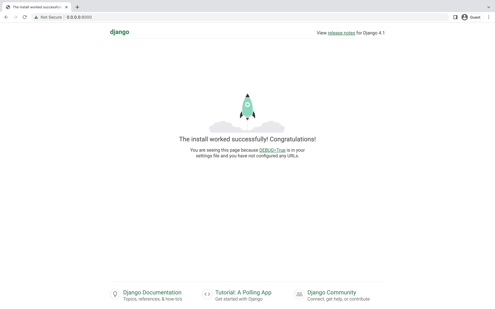

# How To Code a To-do List App

### Project Setup

Download and install the following required software if you don't already have them:
  - Git - https://git-scm.com/downloads
  - Visual Studio Code - https://code.visualstudio.com
  - Google Chrome - https://www.google.com/chrome
  - Docker Desktop - https://www.docker.com
In a terminal window, run the following commands to download the project to your `Documents` folder:

  ```bash
  cd ~/Documents
  git clone https://github.com/andrewrobles/to-do-project.git
  ```

- Open up the project in Visual Studio Code by going to `File > Open` and navigating to `~/Documents/to-do-project`
- Enable auto save by going to `File > Auto Save`
- Open up a terminal window by going to `View > Terminal`
- Start the project by running `docker-compose up` and opening the URL in a Google Chrome browser window provided in the terminal output - http://0.0.0.0:8000/
- You should see something like this:
  

### Create the TodoItem Model

In the `code/todo/models.py` file we will define all objects called `Models` - this is a place in which we will define our to-do item.

Let's open the `code/todo/models.py` in the code editor, remove everything from it, and write code like this:

```python
from django.db import models

class TodoItem(models.Model):
    text = models.CharField(max_length=200)
    done = models.BooleanField(default=False)
```

All lines starting with `from` or `import` are lines that add some bits from other files. So instead of copying and pasting the same things in every file, we can include some parts with `from ... import ...`

`class TodoItem(models.Model):` - this line defines our model.

- `class` is a special keyword that indicates that we are defining an object.
- `TodoItem` is the name of our model. We can give it a different name (but we must avoid special characters and whitespace). Always start a class name with an uppercase letter.
- `models.Model` means that the `TodoItem` is a Django Model, so Django knows that it should be saved in the database.

We also defined two different attributes that each to-do item should have: `text` and `done`. The data field types of each of these attributes are the following:

- `models.CharField` - this is how you define text with a limited number of characters.
- `models.BooleanField` - this is how you define values that can either be `True` or `False`.

In a separate terminal window from where you ran the `docker-compose` command, run the following:

```bash
./manage.sh makemigrations
```

You should see something similar to the following:

```
Migrations for 'todo':
  todo/migrations/0001_initial.py
    - Create model TodoItem
```

By running `makemigrations`, you're telling Django that you've made some changes to your models (in this case, you've made new ones) and that you'd like the changes to be stored as a _migration_.

Migrations are how Django stores changes to your models (and thus your database schema) - they're files on disk. You can read the migration for your model if you like; it's the file `todo/migrations/0001_initial.py`. Don't worry, you're not expected to read them every time Django makes one, but they're designed to be human-editable in case you want to manually tweak how Django changes things.

There's a command that will run the migrations for you and manage your database schema automatically - that's called `migrate`.

Now, run `migrate` again to create those model tables in your database:

```bash
./manage.sh migrate
```

You should see something similar to the following:

```
Operations to perform:
  Apply all migrations: admin, auth, contenttypes, todo, sessions
Running migrations:
  Rendering model states... DONE
  Applying todo.0001_initial... OK
```

The `migrate` command takes all the migrations that haven't been applied (Django tracks which ones are applied using a special table in your database called `django_migrations`) and runs them against your database - essentially, synchronizing the changes you made to your models with the schema in the database.

If you ever want to make future changes to your `models.py` file again, remember the three-step guide to making model changes:

- Change your models (in `models.py`).
- Run `python manage.py makemigrations` to create migrations for those changes
- Run `python manage.py migrate` to apply those changes to the database.

### Playing with the API

Now, let’s hop into the interactive Python shell and play around with the free API Django gives you. To invoke the Python shell, use this command:

```bash
./manage.sh shell
```

Once you’re in the shell, explore the database API:

```python
# Import the model classes we just wrote.
>>> from todo.models import TodoItem  

# No todo items are in the system yet.
>>> TodoItem.objects.all()
<QuerySet []>

# Create a new TodoItem.
>>> t = TodoItem(text="Go for a run", done=False)

# Save the object into the database. You have to call save() explicitly.
>>> t.save()

# Now it has an ID.
>>> t.id
1

# Access model field values via Python attributes.
>>> t.text
'Go for a run'

# Change values by changing the attributes, then calling save().
>>> t.text = 'Go to the gym'
>>> t.save()

# objects.all() displays all the todo items in the database.
>>> TodoItem.objects.all()
<QuerySet [<TodoItem: TodoItem object (1)>]>

# Exit out of your Python shell
>>> exit()
```

Wait a minute. `<TodoItem: TodoItem object (1)>` isn’t a helpful representation of this object. Let’s fix that by editing the `TodoItem` model (in the `code/todo/models.py` file) and adding a `__str__()` method to `TodoItem`:

```python
from django.db import models

class TodoItem(models.Model):
    # ...
    def __str__(self):
        return self.text
```

It’s important to add `__str__()` methods to your models, not only for your own convenience when dealing with the interactive prompt, but also because objects’ representations are used throughout Django’s automatically-generated admin.

Run `./manage.sh shell` again:

```python
# Import the model class
>>> from todo.models import TodoItem

# Make sure our __str__() addition worked.
>>> TodoItem.objects.all()
<QuerySet [<TodoItem: Go to the gym>]>

# Exit out of your Python shell
>>> exit()
```

Let’s update the contents of `code/todo/models.py` to:

```python
from django.db import models

class TodoItem(models.Model):
    text = models.CharField(max_length=200)
    done = models.BooleanField(default=False)

    @property
    def striked_text(self):
        STRIKE_CHARACTER = '\u0336'
        new_text = ''
        for letter in self.text:
            new_text = new_text + letter + STRIKE_CHARACTER
        return new_text

    def __str__(self):
        if self.done == True:
            return self.striked_text
        else:
            return self.text
```

Start a new Python interactive shell by running `./manage.sh shell` again:

```python
# Import the model class
>>> from todo.models import TodoItem

# Make sure our custom method worked.
>>> t = TodoItem.objects.get(id=1)
>>> t.striked_text
G̶o̶ ̶t̶o̶ ̶t̶h̶e̶ ̶g̶y̶m̶

# Request an ID that doesn't exist, this will raise an exception.
>>> TodoItem.objects.get(id=2)
Traceback (most recent call last):
    ...
DoesNotExist: TodoItem matching query does not exist.

# Create three todo items. The create call constructs a new
# TodoItem object, and saves to the database in one step
>>> TodoItem.create(text='Cook dinner', done=True)
<TodoItem: C̶o̶o̶k̶ ̶d̶i̶n̶n̶e̶r̶>
>>> TodoItem.create(text='Take out the trash', done=False)
<Choice: Take out the trash>

# Another useful function is the ability to filter objects by its attributes:
# First show all todo items
>>> TodoItem.objects.all()
<QuerySet [<TodoItem: G̶o̶ ̶t̶o̶ ̶g̶y̶m̶>, <TodoItem: Cook dinner>, <TodoItem: Take out the trash>]>

# Filter todo items by those marked as done
>>> TodoItem.objects.filter(done=True)
<QuerySet [<TodoItem: G̶o̶ ̶t̶o̶ ̶g̶y̶m̶>]>
```

Note: Some of the content in this document was taken from tutorials on the Django website https://www.djangoproject.com/ and Django Girls https://djangogirls.org/en/
