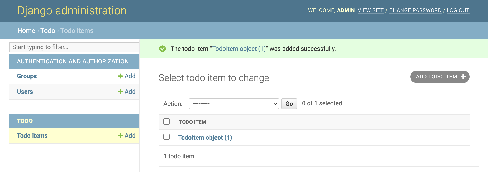
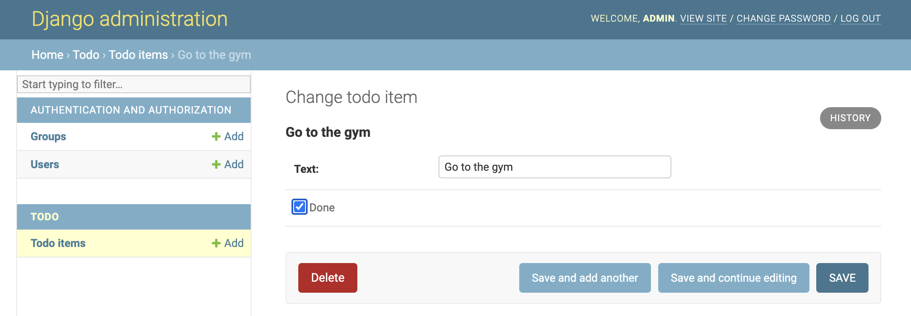

# How To Code a To-do List App


### Introduction

What you will build in this tutorial is a to-do list app. You will quickly see that you only need to define a few simple methods and attributes to have all required functionalities of a to-do list app:

- Create a to-do item
- Edit to-do item text
- Mark a to-do item as completed
- Show that a to-do item is complete with a strike through the to-do item text
- Delete a to-do item

In order to quickly churn-out a working app, we will use existing tools to help us create a low-code app so that we don't get overwhelmed reinventing the wheel. This will make more sense as we progress through the tutorial.

### Project Setup

Download and install the following required software if you don't already have them:
  - Git - https://git-scm.com/downloads
  - Visual Studio Code - https://code.visualstudio.com
  - Google Chrome - https://www.google.com/chrome
  - Docker Desktop - https://www.docker.com
In a terminal window, run the following commands to download the project to your `Documents` folder:

  ```bash
  cd ~/Documents
  git clone https://github.com/andrewrobles/to-do-project.git
  ```

- Open up the project in Visual Studio Code by going to `File > Open` and navigating to `~/Documents/to-do-project`
- Enable auto save by going to `File > Auto Save`
- Open up a terminal window by going to `View > Terminal`
- Start the project by running `docker-compose up` and opening the URL in a Google Chrome browser window provided in the terminal output - http://0.0.0.0:8000/
- You should see something like this:
  

### Create the TodoItem Model

Let's open the `code/todo/models.py` in the code editor, remove everything from it, and write code like this:

```python
from django.db import models

class TodoItem(models.Model):
    text = models.CharField(max_length=200)
    done = models.BooleanField(default=False)
```

Here we defined two different attributes that each to-do item should have: 
- `text`: A short description of the to-do item. For example, "Do math homework".
- `done`: A flag that will be used to mark if the to-do item has been completed. It will be set to `True` if it has been completed, and `False` otherwise.

In a separate terminal window from where you ran the `docker-compose` command, run the following command to tell your app that you've made changes to what your database should look like:

```bash
./manage.sh makemigrations
```

You should see something like this:

```
Migrations for 'todo':
  todo/migrations/0001_initial.py
    - Create model TodoItem
```

Now, run the following command to make those changes in the database:

```bash
./manage.sh migrate
```

You should see something similar to the following:

```
Operations to perform:
  Apply all migrations: admin, auth, contenttypes, todo, sessions
Running migrations:
  Rendering model states... DONE
  Applying todo.0001_initial... OK
```

In general, if you ever want to make changes to your `models.py` file, you should follow the steps we just did:

1.  Change your models (in `models.py`)
2.  Run `./manage.sh makemigrations`
3.  Run `./manage.sh migrate` 

### Using the app

Add the following code to `code/todo/admin.py`
```python
from django.contrib import admin

from .models import TodoItem

admin.site.register(TodoItem)
```
- With the server running, open `http://0.0.0.0:8000/admin` and login using `admin` as the username and `1234` as the password.
- Use the app to create a new to-do item
- You should now see the following:



Wait a minute. `<TodoItem: TodoItem object (1)>` isn’t a helpful representation of this object. Let’s fix that by editing the `TodoItem` model (in the `code/todo/models.py` file) and adding a `__str__()` method to `TodoItem`:

```python
from django.db import models

class TodoItem(models.Model):
    # ...
    def __str__(self):
        return self.text
```

It’s important to add `__str__()` methods to your models for your own convenience so it's easier to tell what object you're looking at.

You should see your to-do item change from `<TodoItem: TodoItem object (1)>` to `Go to the gym` in your list of to-do items:


Now, we are going to write some code so that any items marked as done are crossed out. Let’s update the contents of `code/todo/models.py` to:

```python
from django.db import models

class TodoItem(models.Model):
    text = models.CharField(max_length=200)
    done = models.BooleanField(default=False)

    @property
    def striked_text(self):
        STRIKE_CHARACTER = '\u0336'
        new_text = ''
        for letter in self.text:
            new_text = new_text + letter + STRIKE_CHARACTER
        return new_text

    def __str__(self):
        if self.done == True:
            return self.striked_text
        else:
            return self.text
```
Using the app, edit the to-do item and click on the checkbox to mark it as done.



If you go back to your list of to-do items, you should see your item crossed out because it was marked as done.


### Practice makes perfect

If this was your first time coding an app, chances are that this was a lot to take in. We recommend that you do the following steps to reset your project and go through the tutorial as many times as it takes for these concepts to sink in. In a separate terminal window, run the following:

```bash
# Reset your code
git stash

# Remove your project
docker system prune -a

# Delete your database
rm code/db.sqlite3
```

### Real-World Application

One of the companies that I worked for used the Django admin to manage their entire backend infrastructure. They did this by extending the functionality of the default interface to do what they wanted and was practical for their use case. If a team was tasked with building the entire application from scratch themselves, then it would have taken them much more time and probably would not have been as robust as if they built off an already trusted system like Django.