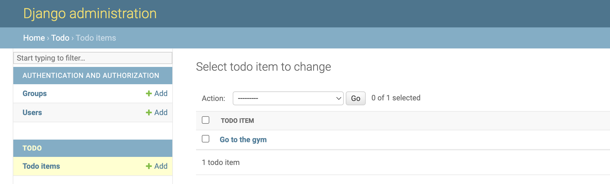

# Step 1 - Store Information In Your Database 

Let's open the `MyApp/models.py` file in the code editor, remove everything from it, and write code like this:

```python
from django.db import models

class ToDoItem(models.Model):
    text = models.CharField(max_length=200)
    done = models.BooleanField(default=False)
```

In a separate terminal window from where you ran the `python manage.py runserver` command, run the following commands to start a virtual environment then tell your app that you've made changes to what your database should look like:

```bash
source VirtualEnvironment/bin/activate
python manage.py makemigrations
```

You should see something like this:

```
Migrations for 'todo':
  todo/migrations/0001_initial.py
    - Create model TodoItem
```

Now, run the following command to make those changes in the database:

```bash
python manage.py migrate
```

You should see something similar to the following:

```
Operations to perform:
  Apply all migrations: admin, auth, contenttypes, todo, sessions
Running migrations:
  Rendering model states... DONE
  Applying todo.0001_initial... OK
```

### Using the app

Add the following code to `MyApp/admin.py`
```python
from django.contrib import admin

from .models import TodoItem

admin.site.register(TodoItem)
```
- Run the following command to create a user and provide a username and password
```bash
python manage.py createsuperuser
```
- With the server running, open `http://127.0.0.1:8000/admin` and login using the username and password you entered in the previous step
- Use the app to create a few to-do items! Examples of some good ones are "Cook some delicious food", and "Eat some delicious food"
- You should now see the following:


Wait a minute. `<TodoItem: TodoItem object (1)>` isn’t a helpful representation of this object. Let’s fix that by editing the `TodoItem` model (in the `MyApp/models.py` file) and adding a `__str__()` method to `TodoItem`:

```python
from django.db import models

class TodoItem(models.Model):
    # ...
    def __str__(self):
        return self.text
```

It’s important to add `__str__()` methods to your models for your own convenience so it's easier to tell what object you're looking at.

You should see your to-do item change from `<TodoItem: TodoItem object (1)>` to `Go to the gym` in your list of to-do items:


